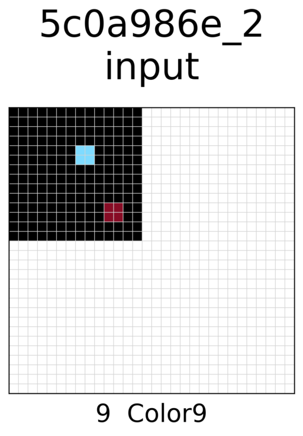

# SOLAR (Synthesized Offline Learning data for Abstraction and Reasoning) Generator

SOLAR Generator generates trajectory data for [Abstraction and Reasoning Corpus(ARC)](https://github.com/fchollet/ARC) tasks to be used for offline reinforcement learning method.

By making it compatible with [ARCLE](https://github.com/ConfeitoHS/arcle) environment, the progress of the trajectory could be executed and visualized in an ARCLE environment.

|  |  |
| ----------------------------------------------- | ---------------------------------------------------- |

## Setup

### Install SOLAR-Generator

SOLAR Generator can be installed by cloning the repository as follows:

```
git clone https://github.com/GIST-DSLab/SOLAR-Generator.git
cd SOLAR-Generator
pip install --upgrade pip
pip install -r requirements.txt

# The following is for creating GIF visualizations on Linux OS.
sudo apt install ffmpeg
```

## File structure

The files are organized according to the following structure.

```
.
├── generate_trajectory.py
├── generate_trajectory.sh
├── utils.py
├── visualize_trajectory.py
├── visualize_trajectory.sh
├── utils_visualize.py
├── maker
│   ├── base_grid_maker.py
│   ├── grid_maker_example.py
│   ├── ${task_id}
│   │   └── grid_maker.py
│   └── ...
├── ARC_data
│   ├── segment
│   │   ├── ${task_id}
│   │   │   ├──${task_id}_${trajectory_id}
│   │   │   │   ├──${task_id}_${trajectory_id}_${segment_id}.json
│   │   │   │   └── ...
│   │   │   └── ...
│   │   └── ...
│   ├── whole
│   │   ├── ${task_id}
│   │   │   ├──${task_id}_${trajectory_id}.json
│   │   │   └── ...
│   │   └── ...
│   └── wrong
│       ├── ${task_id}
│       │   ├──${task_id}_${trajectory_id}.json
│       │   └── ...
|       └── ...
├── figure
│   ├── ${task_id}
│   │   ├── gif
│   │   │   ├── pngs_${task_id}_${trajectory_id}
│   │   │   │   ├── ${i-th step}.png
│   │   │   │   └── ...
│   │   │   ├── ${task_id}_${trajectory_id}.gif
│   │   │   └── ...
│   │   ├── segment
│   │   │   ├── ${task_id}_${trajectory_id}_${segment_id}.png
│   │   │   └── ...
│   │   ├── whole
│   │   │   ├── ${task_id}_${trajectory_id}.png
│   │   │   └── ...
│   │   ├── wrong
│   │   │   ├── ${task_id}_${trajectory_id}.png
│   │   │   └── ...
│   │   └── inout
│   │       ├── ${task_id}_${trajectory_id}.png
│   │       └── ...
│   └── ...
├── make_prettier.sh
├── requirement.txt
└── README.md
```

`generate_trajectory.py` and `generate_trajectory.sh` files are the main files to generate trajectory data.

`utils.py` is a collection of utility functions for generating trajectory

`visualize_trajectory.py` and `visualize_trajectory.sh` file are the main files to visualize the trajectory

`utils_visualize.py` is a collection of utility functions for visualizing trajectory

`maker` folder contains `base_grid_maker` and `grid_maker_example.py`. `grid_maker.py` exists for each task folder, and is for making new grids that match the conditions in the task. `grid_maker_example.py` base_grid_maker` is for changing data type to handle our data in ARCLE environment.

Created trajectorys are saved in the `ARC_data` folder. Whole trajectorys would be saved in the `whole` folder and partially cropped trajectorys for the specific purpose would be saved in the `segment` folder. If there's any problem in making a trajectory or the generated output is not correct, the trajectory will be saved in the `wrong` folder.

When you execute `visualize_trajectory.py`, the figure will be saved in the `figure` folder.
`gif` for trajectory gif, `whole` for whole trajectory, `segment` for segment trajectory, `wrong` for wrong trajectory, and `inout` for visualizing only input-output pairs.

`make_prettier.sh` applies prettier to JSON file to make it easy to see. The code to install prettier is below.

```
npm install --save-dev --save-exact prettier
```

## How to use

1. Make a task folder in the `maker` folder.
2. Make `grid_maker.py` inside the task folder and implement it appropriately.
3. Run `generate_trajectory.py` or `generate_trajectory.sh` with options.
4. If you want to visualize a trajectory, run `visualize_trajectory.py` or `visualize_trajectory.sh` with options.
5. For more details, each file contains detailed explanations.

### Possible options `generate_trajectory.py` and `generate_trajectory.sh`

| Argument                | Description                                       | comment                                                                                    |
| ----------------------- | ------------------------------------------------- | ------------------------------------------------------------------------------------------ |
| `env`                   | environment name, version of ARCLE                | `default`: `ARCLE/O2ARCv2Env-v0`                                                           |
| `tasks`                 | task_ids for make new trajectory                  | `required`, can use multiple args, `tasks.txt` file contains task_ids, `all` for all tasks |
| `data_folder_path`      | folder to save trajectory data                    | `default`: `SOLAR_data` folder <br> if not exist, create folder                            |
| `num_samples`           | number of samples to make in each task            | `default`: 10000                                                                           |
| `num_examples`          | number of example pairs for each trajectory data  | `default`: 3                                                                               |
| `max_grid_size`         | maximum grid size h, w                            | `default`: (h,w)=(30,30)                                                                   |
| `horizon`               | step length of segment trajectory                 | `default`: 5                                                                               |
| `save_whole_trajectory` | whether save whole trajectory or not              | `default`: `True`                                                                          |
| `save_seg_trajectory`   | whether save segment trajectory or not            | `default`: `True`                                                                          |
| `render_mode`           | whether see the rendering process or not          | `default`: `None` <br> `ansi` to see the rendering                                         |
| `delete_existing_data`  | whether delete existing trajectory or raise error | `default`: `False`, raising an error if data already exists                                |
| `rand_seed`             | random seed that all grid_makers share            | `default`: 0                                                                               |

#### Example code

```
# example for adjusting arguments
python generate_trajectory.py --tasks 46442a0e --save_whole_trajectory False --save_seg_trajectory False --num_samples 100 --max_grid_size 30 30 --horizon 5 --render_mode ansi --delete_existing_data True
```

or you can use a shell file(recommended!)

It is a more efficient method to adjust multiple arguments.

```
sh generate_trajectory.sh
```

## Image visualization of trajectory

| Argument           | Description                        | comment                                                             |
| ------------------ | ---------------------------------- | ------------------------------------------------------------------- |
| `mode`             | environment name, version of ARCLE | `default`:`whole` <br>candidate: `segment`, `inout`, `wrong`, `gif` |
| `data_folder_path` | folder path that JSON file exist   | `default`: `SOLAR_data` folder                                      |
| `save_folder_path` | folder path to save figure         | `default`: `figure` folder                                          |
| `file_name`        | JSON file name                     | `required`                                                          |

#### Example code

```
#for gif
python visualize_trajectory.py --file_name <json_file_name> --mode gif
```

or you can use a shell file(recommended!)

It is a more efficient method to adjust multiple arguments.

```
sh visualize_trajectory.sh
```

#### Whole trajectory


